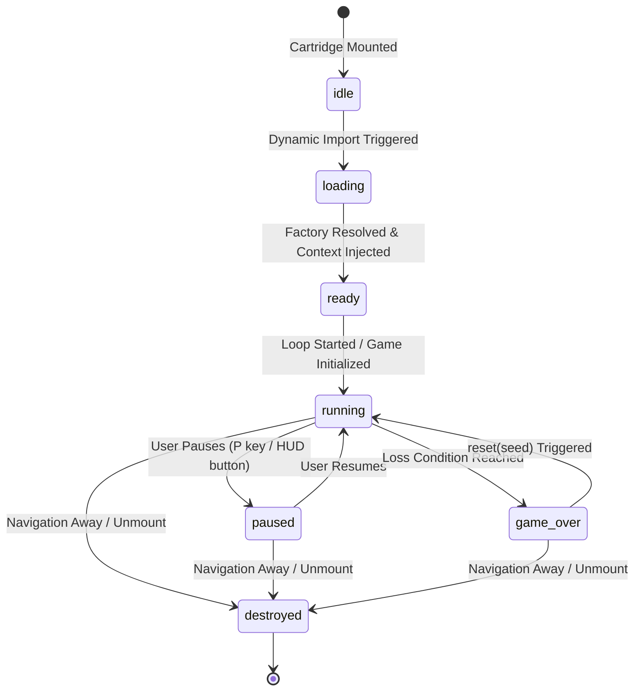

<!-- ARCADE_ v1.2.2 -->
# System Architecture & Technical Design

This document details the architectural boundaries, system layers, dependency rules, data flows, and lifecycle contracts of the **ARCADE_** platform.

---

## 1. High-Level Architecture Overview

ARCADE_ is designed around a strict unidirectional dependency hierarchy. The browser application and UI layer wrap an entirely decoupled, framework-independent 2D game engine:

```text
┌────────────────────────────────────────────────────────────────────────┐
│ APPLICATION LAYER (Next.js 16 App Router)                              │
│   ├── Page Routing (/games/[slug], /case-studies, /about, /faq)        │
│   ├── SEO Metadata Generation & Schema.org JSON-LD                     │
│   └── Static Site Generation (generateStaticParams)                    │
└───────────────────────────────────┬────────────────────────────────────┘
                                    │ mounts
                                    ▼
┌────────────────────────────────────────────────────────────────────────┐
│ UI & PRESENTATION LAYER (React 19 Components)                          │
│   ├── Arcade Shell, Navigation, Search Bar, CRT & Glow Filters         │
│   ├── Cartridge Cards & Filter Selectors                               │
│   └── GameShell (Canvas Container, Mobile D-Pad HUD, Steam Overlay)    │
└───────────────────────────────────┬────────────────────────────────────┘
                                    │ instantiates
                                    ▼
┌────────────────────────────────────────────────────────────────────────┐
│ ENGINE RUNTIME (Pure TypeScript, Zero Framework Dependencies)          │
│   ├── GameEngine (Master Orchestrator)                                 │
│   ├── GameLoop (60Hz Deterministic Accumulator Loop)                   │
│   ├── GameSession (Status Machine, Score & Frame Replay Recorder)      │
│   ├── InputManager (Keyboard, Virtual Touch D-Pad, Gamepad)            │
│   ├── CanvasRenderer & PixelRenderer (Canvas 2D, Quantization)         │
│   └── AudioManager (Procedural Web Audio API Synthesizer)              │
└───────────────────────────────────┬────────────────────────────────────┘
                                    │ passes GameContext to
                                    ▼
┌────────────────────────────────────────────────────────────────────────┐
│ GAME IMPLEMENTATION LAYER (Cartridges)                                 │
│   ├── 61 Autonomous Game Implementations (Implements GameInstance)     │
│   └── 61 Metadata Definitions & Lazy Dynamic Import Factories          │
└───────────────────────────────────┬────────────────────────────────────┘
                                    │ imports
                                    ▼
┌────────────────────────────────────────────────────────────────────────┐
│ CORE FOUNDATION LAYER                                                  │
│   ├── Math Primitives (Vector2, AABB, Matrix2, RandomSource, Noise)    │
│   ├── Algorithms (A*, BFS, FloodFill, SpatialHash, Minimax, Leven)     │
│   ├── Type Definitions (GameAction, GameStatus, GamePlatform)          │
│   └── Shared Timing & Search Constants                                 │
└────────────────────────────────────────────────────────────────────────┘
```

---

## 2. Layer Responsibilities & Strict Isolation Rules

To ensure long-term maintainability, strict architectural boundaries are enforced:

### Application & Routing Layer (`app/`)
- **Responsibilities:** Next.js App Router routing, server components, static parameter generation (`generateStaticParams`), dynamic OpenGraph metadata, JSON-LD structured data injection.
- **Allowed to import:** `components/`, `lib/`, `games/registry`, `core/types`.
- **Forbidden:** Must never directly instantiate or manipulate game state.

### UI & Presentation Layer (`components/`)
- **Responsibilities:** Rendering web UI, managing HUD overlays, capturing touch gestures, mounting `<canvas>`, handling fullscreen mode.
- **Allowed to import:** `engine/`, `games/registry`, `lib/`, `core/`.
- **Key Boundary:** `GameShell.tsx` acts as the sole bridge between React and the engine. React state updates are completely decoupled from the 60Hz engine loop to prevent virtual DOM re-render thrashing.

### Engine Runtime Layer (`engine/`)
- **Responsibilities:** 60Hz fixed-timestep physics loop, input normalization, procedural audio synthesis, 2D canvas drawing abstraction, session lifecycle orchestration.
- **Allowed to import:** `core/`, `games/types`.
- **Forbidden:** Zero imports from `react`, `next`, `app/`, or `components/`. The engine is pure, framework-agnostic TypeScript.

### Game Implementation Layer (`games/`)
- **Responsibilities:** Cartridge-specific gameplay logic, level rules, enemy AI, scoring, and rendering commands.
- **Allowed to import:** `core/`, `engine/GameContext`, `engine/rendering/Renderer`.
- **Forbidden:** Games must never access `window`, `document`, React hooks, or global singletons directly. All external capabilities are supplied via `GameContext`.

### Core Foundation Layer (`core/`)
- **Responsibilities:** Mathematical classes (`Vector2`, `Matrix2`, `AABB`), algorithms (`aStar`, `bfs`, `minimax`, `spatialHash`), seeded PRNG (`RandomSource`), type definitions, and constants.
- **Allowed to import:** Other `core/` modules only.
- **Forbidden:** Zero dependencies on engine, games, UI, or browser globals. Core modules can execute in any JavaScript environment (Node.js, Web Workers, Vitest).

---

## 3. The `GameInstance` Contract

Every playable cartridge implements the standardized `GameInstance` interface defined in `games/types.ts`:

```typescript
export interface GameInstance {
  /** Called once when the cartridge is inserted and engine is ready. */
  init(ctx: GameContext): void;

  /** Discrete fixed simulation tick (dt is always constant, e.g. 1/60s). */
  update(deltaTime: number): void;

  /** Render frame callback to draw on the canvas using integer coordinates. */
  render(renderer: Renderer): void;

  /** Input handler invoked on keydown/keyup or virtual button events. */
  handleInput(action: GameAction, isPressed: boolean): void;

  /** Called when the player or system pauses the game. */
  pause(): void;

  /** Called when resuming gameplay from pause. */
  resume(): void;

  /** Resets internal game state using the specified PRNG seed. */
  reset(seed?: number): void;

  /** Destroys timers, event listeners, and pools to prevent memory leaks. */
  destroy(): void;

  /** Returns current game score. */
  getScore(): number;

  /** Returns current game level or difficulty stage. */
  getLevel(): number;

  /** Optional line count (e.g. Tetris). */
  getLines?(): number;

  /** Optional remaining lives (e.g. Breakout, Pac-style games). */
  getLives?(): number;
}
```

---

## 4. Game Lifecycle State Machine

A cartridge transitions through distinct lifecycle states managed by `GameSession`:



### Lifecycle Phases:
1. **Instantiation (`createGame()`):** The dynamic `import()` resolves and instantiates the cartridge class.
2. **Initialization (`init(ctx)`):** The engine passes `GameContext` (session, input, renderer, audio, PRNG). The game allocates internal entities and object pools.
3. **Simulation Tick (`update(dt)`):** The `GameLoop` calls `update` at exactly 60Hz. If a frame takes 33ms, `update` is executed twice with `dt = 0.016667s`.
4. **Render Tick (`render(renderer)`):** The `GameLoop` calls `render` once per browser animation frame after all physics steps have completed.
5. **Teardown (`destroy()`):** The player leaves the route. The `GameShell` calls `destroy()`, which cancels RAF IDs, clears object pools, resets particle buffers, and detaches DOM listeners.

---

## 5. End-to-End Cartridge Launch Data Flow

```mermaid
sequenceDiagram
    autonumber
    actor User
    participant Router as Next.js App Router
    participant Shell as GameShell (React)
    participant Registry as Game Registry
    participant Engine as GameEngine
    participant Loop as GameLoop
    participant Game as GameInstance

    User->>Router: Navigates to /games/tetris
    Router->>Shell: Mounts GameShell with slug="tetris"
    Shell->>Registry: getGameBySlug("tetris")
    Registry-->>Shell: Returns GameDefinition
    Shell->>Engine: new GameEngine({ canvas, gameId: "tetris", seed: 1337 })
    Shell->>Registry: def.createGame()
    Registry->>Game: Dynamic import("../tetris/TetrisGame")
    Registry-->>Shell: Returns new TetrisGame()
    Shell->>Engine: engine.loadGame(instance)
    Engine->>Game: game.init(context)
    Engine->>Loop: loop.start()
    
    loop 60Hz Fixed Accumulator
        Loop->>Engine: update(FIXED_DT)
        Engine->>Game: game.update(0.016667)
    end

    loop Browser Animation Frame
        Loop->>Engine: render()
        Engine->>Game: game.render(renderer)
    end
```

---

## 6. Central Static Registry Architecture

All cartridges are registered in `games/registry.ts`. Rather than scanning the filesystem at runtime, definitions are statically typed and exported:

```typescript
export const gameRegistry: readonly GameDefinition[] = [
  tetrisDefinition,
  snakeDefinition,
  breakoutDefinition,
  pongDefinition,
  minesweeperDefinition,
  // ... all 61 verified cartridges
];
```

### Architectural Benefits:
- **Compile-Time Safety:** Any missing fields, wrong enum values, or signature breaks immediately fail `npm run typecheck`.
- **Zero Runtime FS Calls:** Next.js can pre-render static metadata during the build step without filesystem I/O.
- **Tree-Shaking & Code Splitting:** Because `createGame` wraps a dynamic `import()`, metadata (name, rules, controls, SEO) is lightweight and bundled into the main chunk, while the heavy game simulation code is isolated in separate asynchronous chunks.

---

## 7. Why Game State Lives Outside React

In a typical React application, state updates trigger component reconciliation. In a 60FPS physics game:
- Updating React state 60 times per second across 500 game entities causes catastrophic garbage collection and dropped frames.
- ARCADE_ keeps all simulation state inside plain TypeScript classes.
- React only observes coarse-grained session events (score changes, pause state, game over) via event listeners in `GameSession`.
