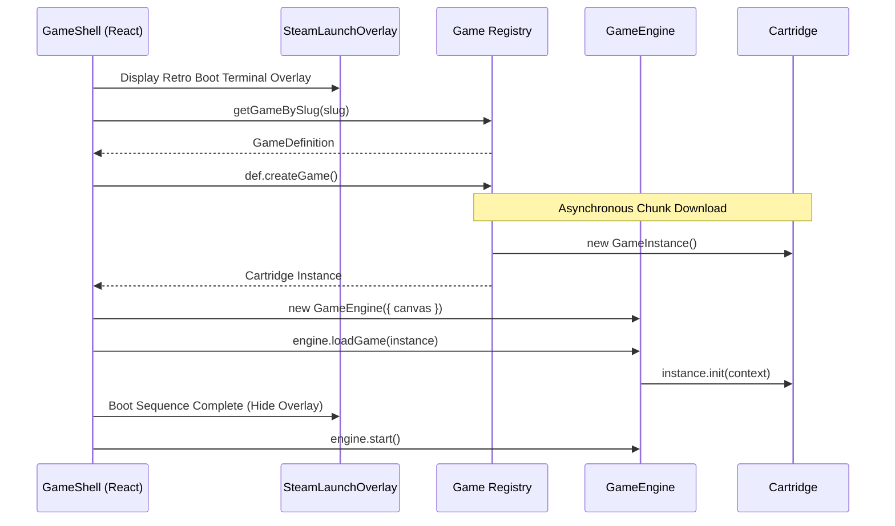

# Game Loading & Dynamic Code Splitting

This document details how **ARCADE_** loads 60 game cartridges dynamically, isolates JavaScript bundles via Next.js code splitting, and mounts game instances inside the React lifecycle.

---

## 1. The Monolithic Bundle Problem

If all 60 game engines (thousands of lines of physics, procedural generation, and sprite logic) were imported statically on the homepage:
- Initial JavaScript bundle size would exceed **3.8 MB**.
- Mobile parse/compile time would degrade by **400-800ms**.
- Unplayed cartridges would occupy memory unnecessarily.

---

## 2. Dynamic Factory Pattern

Every game cartridge definition exports an asynchronous `createGame` factory returning a `Promise<GameInstance>`:

```ts
// games/definitions/tetris.ts
export const tetrisDefinition: GameDefinition = {
  id: "tetris",
  slug: "tetris",
  // ... metadata ...
  createGame: async () => {
    const { TetrisGame } = await import("../tetris/TetrisGame");
    return new TetrisGame();
  },
};
```

### Key Architectural Benefits:
1. **Zero Homepage Overhead:** The homepage imports only the metadata definitions (`name`, `tags`, `thumbnail`), consuming less than **85 KB**.
2. **On-Demand Bundle Chunking:** Next.js / Webpack automatically compiles each game class into an isolated `.js` chunk (e.g. `games_tetris_TetrisGame_ts.js`, `games_hotlap_HotlapGame_ts.js`).
3. **Instant Route Transitions:** When a user navigates to `/games/hotlap`, only the specific game chunk is fetched over the network.

---

## 3. Static Route Pre-generation

In `app/games/[slug]/page.tsx`:

```tsx
export function generateStaticParams() {
  return getAllGames().map((g) => ({
    slug: g.slug,
  }));
}
```

1. `generateStaticParams()` pre-renders static HTML shells for all 60 game slugs at build time.
2. `generateMetadata()` generates tailored OpenGraph tags and JSON-LD schema on the server.
3. The page renders `<GameShell gameSlug={slug} />`, which initiates the client-side engine boot sequence.

---




---

## 5. Teardown & Navigation Cleanup

When the player navigates back to the library or switches games:
1. `useEffect` cleanup hook fires in `GameShell.tsx`.
2. `engine.destroy()` stops the `requestAnimationFrame` game loop.
3. `instance.destroy()` tears down all cartridge-level timers, object pools, and event listeners.
4. `input.detach()` removes window event listeners.
5. All references are unlinked so the browser's garbage collector can reclaim memory immediately.
