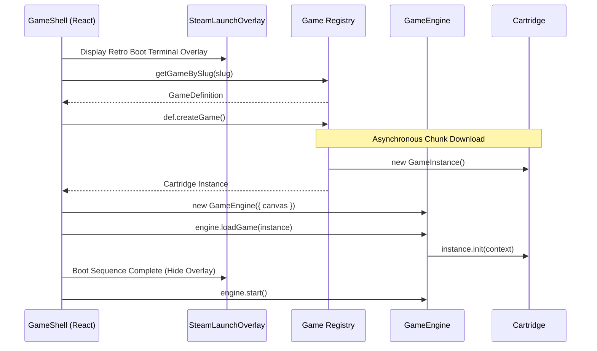

# Game Loading & Dynamic Code Splitting

This document details how **ARCADE_** loads 61 game cartridges dynamically, isolates JavaScript bundles via Next.js code splitting, and mounts game instances inside the React lifecycle.

---

## 1. The Monolithic Bundle Problem

If all 61 game engines (thousands of lines of physics, procedural generation, and sprite logic) were imported statically on the homepage:
- The initial JavaScript payload would exceed several megabytes.
- Mobile devices on cellular connections would experience severe Time to Interactive (TTI) degradation.
- Users who only want to browse or play a single game would download 60 unused game engines.

---

## 2. Dynamic Factory Pattern (`createGame`)

Every cartridge definition in `games/definitions/` exposes a lazy asynchronous factory function:

```typescript
// games/definitions/tetris.ts
export const tetrisDefinition: GameDefinition = {
  id: "tetris",
  slug: "tetris",
  name: "Tetris",
  // ... metadata, controls, SEO, math ...
  createGame: async () => {
    const { TetrisGame } = await import("../tetris/TetrisGame");
    return new TetrisGame();
  },
};
```

### How the Bundler Splits Chunks
1. The static metadata (`name`, `slug`, `tags`, `tagline`, `difficulty`) is bundled into the lightweight shared registry chunk used by the homepage and search index.
2. The dynamic `import("../tetris/TetrisGame")` creates an isolated async JavaScript chunk.
3. The heavy game code is **only fetched over the network when the user navigates to `/games/tetris`**.

---

## 3. Dynamic Route Mounting (`app/games/[slug]/page.tsx`)

When a player visits a cartridge route:
1. `generateStaticParams()` pre-renders static HTML shells for all 61 game slugs at build time.
2. `generateMetadata()` generates tailored OpenGraph tags and JSON-LD schema on the server.
3. The page renders `<GameShell gameSlug={slug} />`, which initiates the client-side engine boot sequence.

---

## 4. `GameShell` Boot Sequence (`components/game/GameShell.tsx`)



---

## 5. Teardown & Navigation Cleanup

When the player navigates back to the library or switches games:
1. `useEffect` cleanup hook fires in `GameShell.tsx`.
2. `engine.destroy()` stops the `requestAnimationFrame` game loop.
3. `instance.destroy()` tears down all cartridge-level timers, object pools, and event listeners.
4. `input.detach()` removes window event listeners.
5. All references are unlinked so the browser's garbage collector can reclaim memory immediately.
